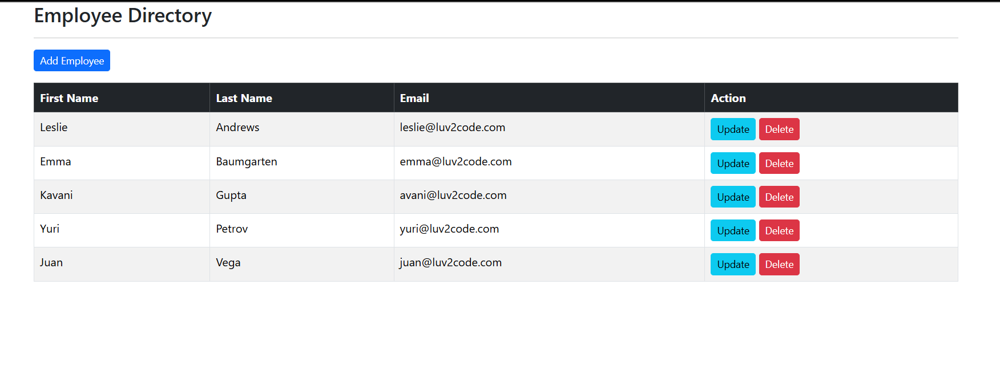

# Employee Management Application

This is a Spring Boot-based Employee Management Application designed to manage employee records efficiently. The application uses a modern tech stack, including Spring Boot, Thymeleaf, MySQL, and RESTful APIs, to provide seamless CRUD operations and a user-friendly interface.


## Features

- **Employee Management**: Add, update, view, and delete employee records.
- **Role-Based Access Control**: Implemented using Spring Security.
- **RESTful APIs**: Support for API-based integration and interaction.
- **Database Integration**: Persistent storage with MySQL.
- **Frontend Integration**: Dynamic HTML rendering using Thymeleaf.
- **Validation**: Server-side and client-side validation for data integrity.

## Tech Stack

- **Backend**: Spring Boot
- **Frontend**: Thymeleaf
- **Database**: MySQL
- **Security**: Spring Security
- **Build Tool**: Maven
- **DevOps**: Docker (Optional)

## Prerequisites

To set up and run this project locally, ensure you have the following installed:

- Java 17 or higher
- Maven
- MySQL
- Git
- IDE (IntelliJ IDEA, Eclipse, or similar)

## Getting Started

### 1. Clone the Repository

```bash
git clone https://github.com/DinelyWellehewage/employee-app.git
cd employee-app
```

### 2. Configure the Database

- Create a database in MySQL named `employee_db`.
- Update the `application.properties` or `application.yml` file in the `src/main/resources` directory with your database credentials:

```properties
spring.datasource.url=jdbc:mysql://localhost:3306/employee_db
spring.datasource.username=<your-username>
spring.datasource.password=<your-password>

# Hibernate properties
spring.jpa.hibernate.ddl-auto=update
spring.jpa.show-sql=true
```

### 3. Build the Project

Run the following command to build the project:

```bash
mvn clean install
```

### 4. Run the Application

Start the application using the following command:

```bash
mvn spring-boot:run
```

The application will be available at [http://localhost:8080](http://localhost:8080).

### 5. Access the Application

- Use the browser to navigate to the application's base URL.
- You can log in using the default credentials or create a new user (if applicable).

## API Endpoints

The application also exposes RESTful APIs for integration. Here are some key endpoints:

| HTTP Method | Endpoint               | Description              |
|-------------|------------------------|--------------------------|
| GET         | `/employees`           | Get all employees        |
| POST        | `/employees`           | Add a new employee       |
| GET         | `/employees/{id}`      | Get employee by ID       |
| PUT         | `/employees/{id}`      | Update an employee       |
| DELETE      | `/employees/{id}`      | Delete an employee       |

[//]: # (## Running Tests)

[//]: # ()
[//]: # (Run the following command to execute the test cases:)

[//]: # ()
[//]: # (```bash)

[//]: # (mvn test)

[//]: # (```)

[//]: # (## Docker Support &#40;Optional&#41;)

[//]: # ()
[//]: # (Build and run the application using Docker:)

[//]: # ()
[//]: # (1. Build the Docker image:)

[//]: # ()
[//]: # (```bash)

[//]: # (docker build -t employee-app .)

[//]: # (```)

[//]: # (2. Run the container:)

[//]: # ()
[//]: # (```bash)

[//]: # (docker run -p 8080:8080 employee-app)

[//]: # (```)


## License

This project is licensed under the MIT License. See the [LICENSE](LICENSE) file for details.

## Contact

For any inquiries or issues, feel free to contact:

Author: **Dinely Wellehewage**  
Email: dinelywh78@gmail.com  
Phone: +49 176 88089979

---


